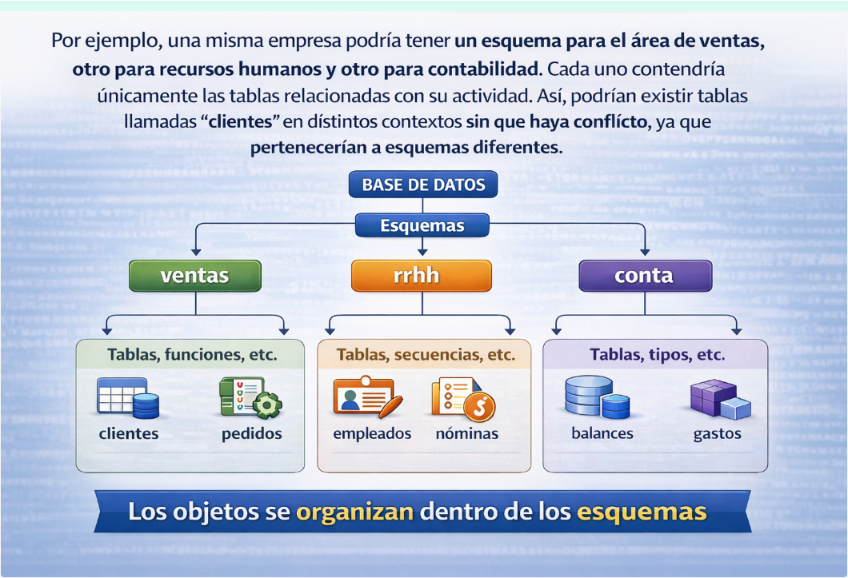

# El lenguaje de control de datos DCL

El Data Control Language (DCL – Lenguaje de control de datos) se utiliza para gestionar los permisos y privilegios de acceso a los objetos dentro de una base de datos, estableciendo políticas de seguridad que determinan qué usuarios o roles pueden interactuar con los datos y de qué manera.

A través del DCL, los administradores de bases de datos pueden otorgar o revocar permisos, asegurando que cada usuario solo pueda realizar las acciones que le han sido expresamente autorizadas. Este control es esencial para proteger la información sensible, evitar accesos no autorizados y mantener la integridad de los datos.

---

## Esquemas

Cuando trabajamos con bases de datos en PostgreSQL, no todo está simplemente “dentro” de la base de datos sin orden. Existe un nivel intermedio de organización llamado **esquema**, que cumple una función muy importante.

Un **esquema** puede entenderse como **una forma de estructurar y separar los distintos objetos** que existen dentro de una misma base de datos. Es decir, **las tablas, vistas, secuencias, funciones o tipos de datos** no se guardan directamente en la base de datos, sino dentro de un esquema.

Podemos imaginar la base de datos como si fuera un archivador grande. Dentro de ese archivador hay carpetas, y dentro de cada carpeta hay documentos. En este caso, las carpetas serían los esquemas y los documentos serían las tablas u otros objetos.

Gracias a esto, es posible organizar la información según su función. 

Además de servir para organizar, **los esquemas** son fundamentales desde el punto de vista de la **seguridad**. En PostgreSQL, los permisos no se conceden únicamente sobre la base de datos en general, sino sobre elementos concretos. Y esos elementos se encuentran dentro de un esquema. Por tanto, si queremos controlar quién puede acceder a ciertas tablas, lo primero que necesitamos es tener claro en qué esquema se encuentran.

También es importante saber que PostgreSQL crea por defecto un esquema llamado **public**, que es donde se crean los objetos si no se indica ningún otro. Por eso, muchas veces trabajamos sin ser conscientes de que estamos usando un esquema, aunque realmente siempre existe.

!!!Note "Resumen"
    **Los esquemas** permiten organizar los objetos de una base de datos y establecer límites claros de acceso. Por este motivo, antes de hablar de usuarios, grupos o roles, es conveniente entender qué son los esquemas, ya que los permisos que se asignan a esos usuarios se aplicarán sobre los objetos contenidos en ellos.

## Usuarios, grupos y roles

Una vez entendido que los objetos de una base de datos se organizan dentro de esquemas, el siguiente paso lógico es plantearse quién puede acceder a esos objetos y qué puede hacer con ellos. Para ello, PostgreSQL utiliza un sistema de control de acceso basado en lo que denomina **roles**.

A diferencia de otros sistemas gestores de bases de datos, **PostgreSQL no distingue realmente entre usuarios y grupos como entidades diferentes. En su lugar, todo se gestiona mediante roles**.   
Un rol puede comportarse como un usuario, como un grupo o como una combinación de ambos, dependiendo de los permisos que tenga asignados.

Un rol que tiene permiso para iniciar sesión en el sistema actúa como un usuario. Es decir, representa a una persona o aplicación que puede conectarse a la base de datos. Por otro lado, un rol que no tiene permiso de inicio de sesión puede utilizarse para agrupar permisos. En ese caso, funciona como un grupo.

!!!Note "ROL"
    PostgreSQL usa una única figura llamada **ROL**, que puede comportarse como:

    - Usuario → si puede iniciar sesión
    - Grupo → si agrupa permisos
    - Rol → si solo sirve para gestionar permisos

Esto permite una gestión mucho más flexible de la **seguridad**. En lugar de asignar permisos directamente a cada usuario, lo habitual es crear roles que representen funciones dentro de la organización, como por ejemplo desarrolladores, administrativos o analistas. Después, se asignan permisos a esos roles sobre determinados esquemas o tablas, y finalmente se asocian los usuarios a los roles correspondientes.

De esta manera, cuando un usuario pasa a formar parte de un rol, hereda automáticamente todos los permisos que dicho rol tenga asignados. Si en algún momento cambian las necesidades de acceso, basta con modificar los permisos del rol en lugar de hacerlo usuario por usuario.

Este sistema simplifica enormemente la administración de la seguridad, especialmente cuando el número de usuarios crece. Además, permite reflejar la estructura real de una organización dentro de la base de datos, separando claramente quién puede conectarse al sistema y qué puede hacer una vez dentro.

!!!Note "Resumen"
    En definitiva, **los roles** son el mecanismo que utiliza PostgreSQL para gestionar la autenticación y los permisos. Gracias a ellos, es posible controlar el acceso a los distintos esquemas y objetos de forma organizada y escalable.

Las instrucciones **CREATE USER** y **CREATE GROUP** son en realidad alias de la instrucción **CREATE ROLE**.  
Para crear un usuario de PostgreSQL, utilizaremos la siguiente instrucción SQL:

    CREATE USER myuser WITH PASSWORD 'passwd';

También se podría crear un usuario con la siguiente instrucción SQL:

    CREATE ROLE myuser WITH LOGIN PASSWORD ‘passwd’;

Ambas sentencias crean exactamente el mismo usuario.  
Este nuevo usuario no tiene ningún permiso, a excepción de los permisos predeterminados disponibles para el rol public.    
Todos los nuevos usuarios y roles heredan los permisos del rol public. 

Un grupo es un rol que se usa para dar permisos a varios usuarios a la vez:

    CREATE ROLE mygroup;

Luego añadimos usuarios:

    GRANT mygroup TO myuser;
   
Ahora _myuser_ hereda permisos del grupo _mygroup_

## Seguridad

El propietario de la base de datos es quien tiene todos los privilegios, pero no es el único que accede a ella. A una base de datos pueden acceder muchas personas, que muchas veces quizá no tengan nada que ver entre sí o no se conozcan al realizar accesos remotos por diferentes motivos.

Por ejemplo, a una base de datos con el stock de productos de una distribuidora con muchas tiendas ubicadas en distintas poblaciones podrán acceder para manipular o consultar datos personas tan distintas como:

* **Receptores de productos** en los almacenes, para actualizar los stocks.
* **Trabajadores para consultar** si hay stock de un producto determinado.
* **Las máquinas registradoras**, automáticamente, para actualizar el stock después de una venta.
* **Los encargados de compras**, para consultar la situación y tomar decisiones.
* **Los trabajadores del departamento** de control para tomar otro tipo de decisiones.
* **Los clientes finales**, desde sus casas, consultando si pueden ir a comprar ese producto determinado.

Como se ve en esta situación, pueden llegar a ser muchas las manos que accedan a los datos. Pero no será lo mismo lo que debe poder ver un cliente final desde su casa que lo que debe ver un trabajador del departamento de control. Por esta razón, es importante asignar una serie de privilegios a los usuarios que acceden a los datos, de tal manera que cada usuario tenga un perfil asignado con unos permisos determinados sobre la base de datos, en global, y sobre las relaciones, en particular.

La asignación de los privilegios se puede llevar a cabo desde dos posibles puntos de vista:

* Desde el punto de vista del usuario.
* Desde el punto de vista de las tablas o las vistas.

La sentencia que se utiliza en ambos casos para asignar permisos es la sentencia **GRANT**.

Su sintaxis es:

    GRANT { <Privilegi1> [, < Privilegi2> ..] } | ALL
    ON [<User1>.]<Objecte>
    TO {<User2> [, <User3> ...]} | PUBLIC.

Los privilegios pueden ser:

* **ALL**: asigna todos los permisos posibles a una tabla o a una vista.
* **SELECT**: asigna el permiso de realizar consultas (leer) a un usuario o sobre una tabla concreta.
* **INSERT**: asigna el permiso de inserción de datos a un usuario o sobre una tabla concreta.
* **UPDATE**: asigna el permiso de modificación de datos a un usuario o sobre una tabla concreta.
* **DELETE**: asigna el permiso de borrado de datos a un usuario o sobre una tabla concreta.
* **INDEX**: asigna el permiso de creación de índices para una tabla concreta o para un usuario.
* **ALTER**: asigna el permiso de modificación de la estructura de una tabla o a un usuario.

Un **objeto** puede ser una tabla o una vista.

Un **user** se refiere a un usuario concreto.

Por ejemplo:

    GRANT SELECT
    ON Productes
    TO Joan

En este ejemplo se otorga el permiso de consulta al usuario Joan sobre la tabla Productos.

La sentencia que se utiliza para quitar los permisos a un usuario determinado o sobre una tabla determinada es REVOKE.

Su sintaxis es:

    REVOKE {ALL | SELECT | INSERT | DELETE | INDEX | ALTER |
    UPDATE | UPDATE(<Columna1> [, <Columna2> ...])}
    ON {<Tabla> | <Vista>}
    FROM {PUBLIC | <Usuario1> [, <Usuario2> ...]}
    {RESTRICT/CASCADE}

Un ejemplo de utilización de la sentencia REVOKE es:

    REVOKE ALL
    ON Proveedores
    TO Joan

En este caso, ahora se eliminan todos los privilegios sobre la tabla Proveedores al usuario Joan, que no podrá ni acceder a registros de esta tabla, ni modificarlos, ni borrarlos.

Las opciones RESTRICT/CASCADE permiten extender o detener la aplicación de la sentencia REVOKE a lo largo de los usuarios a los que se hayan ido concediendo permisos. Es decir, si un usuario B dio permisos al usuario C para acceder a una tabla determinada y ahora el usuario B recibe una sentencia que revoca sus privilegios para acceder a esta tabla con la indicación CASCADE, automáticamente el usuario C perderá también los privilegios de acceso a dicha tabla.

## Esquema public y rol public

**Cuando creamos una nueva base de datos**, PostgreSQL crea de forma predeterminada un esquema denominado **public** y concede acceso en este esquema a un **rol de backend denominado public**. A todos los usuarios y roles nuevos se les concede de forma predeterminada el **rol public** y, por lo tanto, pueden crear objetos en el esquema public.

Si un usuario crea una tabla sin indicar el esquema, se guarda en **public**.  
Por defecto, todos los usuarios pueden crear objetos en este esquema, lo que impide tener usuarios realmente de solo lectura, ya que heredan ese permiso del rol public.

Para solucionarlo, se debe **revocar el permiso de creación predeterminado en el esquema public desde el rol public** mediante la siguiente instrucción SQL:

    REVOKE CREATE ON SCHEMA public FROM PUBLIC;

Nos aseguraremos de ser el propietario del esquema public ha de formar parte de un rol que le permita ejecutar esta instrucción SQL.  
La siguiente declaración **revoca la capacidad del rol público de conectarse a la base de datos**:

    REVOKE ALL ON DATABASE mydatabase FROM PUBLIC;

Al quitar los permisos del rol public, los usuarios ya no podrán conectarse ni crear objetos por defecto.
Por eso, antes de hacerlo en producción, hay que dar permisos explícitos a quienes sí los necesiten.

## Roles del sistema en PostgreSQL: los roles pg_...

Al crear una instalación de PostgreSQL, además de los usuarios que el administrador pueda definir, el sistema incorpora automáticamente una serie de roles internos cuyos nombres comienzan por el prefijo **pg_**. Estos roles no representan usuarios reales ni están pensados para iniciar sesión en la base de datos, sino que forman parte del propio mecanismo de seguridad del sistema.

Estos roles se emplean asignándolos a otros usuarios o roles creados por el administrador. De este modo, es posible otorgar capacidades específicas, como consultar información global o supervisar la actividad del servidor, sin necesidad de conceder privilegios de superusuario.

Por tanto, su función principal es servir como mecanismos de delegación de permisos concretos. Gracias a ellos, se puede proporcionar a un usuario únicamente las capacidades necesarias para su trabajo, manteniendo al mismo tiempo un control más seguro sobre el sistema.

En definitiva, los roles **pg_** no se crean ni se alteran, sino que se utilizan mediante su asignación a otros roles para distribuir privilegios de forma controlada.

## Crear roles de base de datos

A continuación, se detalla el proceso de creación de nuevos roles y concesión de permisos para acceder a varios objetos de base de datos. Los permisos debemos concederlos a nivel de base de datos, esquema y objeto de esquema. Por ejemplo, si necesitamos conceder acceso a una tabla, también debemos asegurarnos de que el rol tenga acceso a la base de datos y al esquema en que existe la tabla. Si falta alguno de los permisos, el usuario/rol no podrá acceder a la tabla.

### Rol de solo lectura

El primer paso consiste en crear un nuevo rol denominado `readonly` mediante la siguiente instrucción SQL:

    CREATE ROLE readonly;

Este es un rol simple sin permisos ni contraseña. No se puede utilizar para iniciar sesión en la base de datos.

Concedemos permiso a este rol para conectarse a la base de datos de destino denominada "mydatabase":

    GRANT CONNECT ON DATABASE mydatabase TO readonly;

El siguiente paso es otorgar acceso al uso de este rol a su esquema. Supongamos que el esquema se llama "myschema":

    GRANT USAGE ON SCHEMA myschema TO readonly;

En este paso se concede permiso de rol de `readonly` para realizar alguna actividad dentro del esquema. Sin este paso, el rol `readonly` no puede realizar ninguna acción en los objetos de este esquema, incluso si se han concedido permisos para esos objetos.

El siguiente paso consiste en otorgar acceso al rol `readonly` para ejecutar las consultas en las tablas requeridas.

    GRANT SELECT ON TABLE mytable1, mytable2 TO readonly;

Si el requisito es conceder acceso a todas las tablas y vistas del esquema, podemos utilizar el siguiente SQL:

    GRANT SELECT ON ALL TABLES IN SCHEMA myschema TO readonly;

La instrucción SQL anterior otorga acceso SELECT al rol de solo lectura en todas las tablas y vistas existentes en el esquema llamado "myschema". Debemos tener en cuenta que el usuario readonly no podrá acceder a las tablas nuevas que se añadan en el futuro.  
Para garantizar que también pueda acceder a nuevas tablas y vistas, deberemos ejecutar la siguiente instrucción para conceder permisos automáticamente:

    ALTER DEFAULT PRIVILEGES IN SCHEMA myschema GRANT SELECT ON TABLES TO readonly;

### Rol de lectura y escritura

El proceso de agregar un rol de lectura/escritura es muy similar al proceso de rol de solo lectura que se trató anteriormente. El primer paso es crear un rol:

    CREATE ROLE readwrite;

Concedemos permiso a este rol para conectarse a la base de datos de destino:

    GRANT CONNECT ON DATABASE mydatabase TO readwrite;

Concedemos privilegio de uso de esquemas:

    GRANT USAGE ON SCHEMA myschema TO readwrite;

Si deseamos permitir que este rol cree nuevos objetos como tablas de este esquema, utilizaremos el siguiente SQL en lugar del anterior:

    GRANT USAGE, CREATE ON SCHEMA myschema TO readwrite;

El siguiente paso sería conceder acceso a las tablas. Como hemos comentado en la sección anterior, la concesión puede realizarse en tablas individuales o en todas las tablas del esquema. Para tablas individuales, utilizaremos el siguiente SQL:

    GRANT SELECT, INSERT, UPDATE, DELETE ON TABLE mytable1, mytable2 TO readwrite;

Para todas las tablas y vistas del esquema:

    GRANT SELECT, INSERT, UPDATE, DELETE ON ALL TABLES IN SCHEMA myschema TO readwrite;

Para conceder automáticamente permisos sobre tablas y vistas añadidas en el futuro:

    ALTER DEFAULT PRIVILEGES IN SCHEMA myschema
    GRANT SELECT, INSERT, UPDATE, DELETE ON TABLES TO readwrite;

Para los roles de lectura y escritura, normalmente existe el requisito de utilizar secuencias también. Podemos dar acceso selectivo de la siguiente manera:

    GRANT USAGE ON SEQUENCE myseq1, myseq2 TO readwrite;

También podemos conceder permiso a todas las secuencias mediante la siguiente instrucción SQL:

    GRANT USAGE ON ALL SEQUENCES IN SCHEMA myschema TO readwrite;

Para conceder permisos automáticamente a las secuencias añadidas en el futuro:

    ALTER DEFAULT PRIVILEGES IN SCHEMA myschema
    GRANT USAGE ON SEQUENCES TO readwrite;

Podremos conceder más o menos permisos en función de los requisitos.  
La documentación del comando GRANT de PostgreSQL proporciona más detalles sobre los objetos en los que se pueden conceder permisos y las sentencias SQL necesarias.

## Creación de usuarios de base de datos  

Con los roles implementados, se simplifica el proceso de creación de usuarios. Simplemente crearemos el usuario y le concederemos uno de los roles existentes. Estas son las instrucciones SQL para este proceso:

    CREATE USER user1 WITH PASSWORD ‘passwd’;

    GRANT readonly TO user1;

Esta instrucción SQL otorga a myuser1 los mismos permisos que el rol de solo lectura.

Del mismo modo, podemos conceder acceso de lectura y escritura a un usuario otorgando el rol readwrite. La documentación CREATE USER de PostgreSQL contiene más detalles sobre los parámetros que podemos establecer al crear un usuario. Por ejemplo, podemos especificar un plazo de caducidad para el usuario o permitir que el usuario cree bases de datos.

## Revocar o cambiar permisos  

Utilizando el método detallado anteriormente, resulta muy fácil revocar los privilegios de un usuario. Por ejemplo, podemos quitar el permiso de lectura y escritura (readwrite) de user1 utilizando la siguiente instrucción SQL:

    REVOKE readwrite FROM user1;

Del mismo modo, podemos otorgar un nuevo rol de la siguiente manera:

    GRANT readonly TO user1;

## Comprobación de roles concedidos  

Podemos utilizar la siguiente consulta para obtener una lista de todos los usuarios y roles de la base de datos junto con una lista de roles que se les han concedido:

    SELECT
    r.rolname,
    ARRAY(SELECT b.rolname
    FROM pg_catalog.pg_auth_members m
    JOIN pg_catalog.pg_roles b ON (m.roleid = b.oid)
    WHERE m.member = r.oid ) as memberof
    FROM pg_catalog.pg_roles r
    ORDER BY 1;

Debemos tener en cuenta que un usuario puede ser miembro de varios roles con permisos distintos o superpuestos. En este caso, el usuario obtiene una suma de todos los permisos.

También se puede utilizar la tabla de catálogo pg_roles para comprobar atributos como la fecha de caducidad de la contraseña o el número de conexiones paralelas permitidas.

