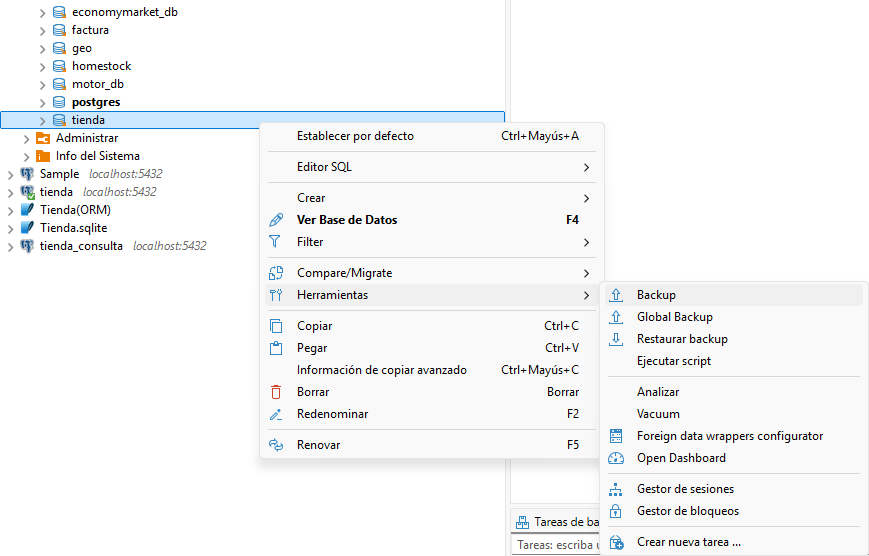
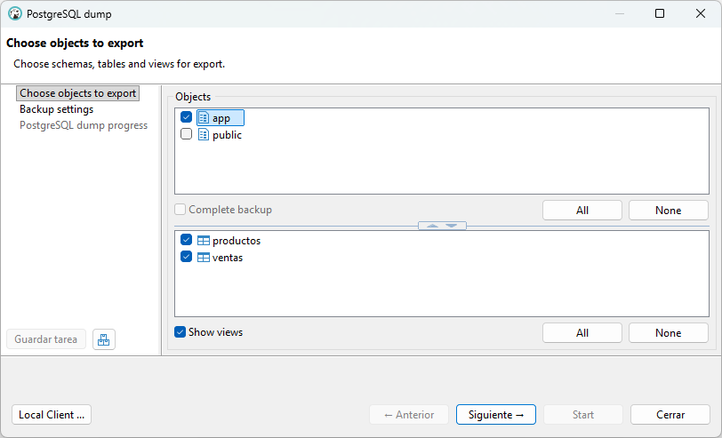
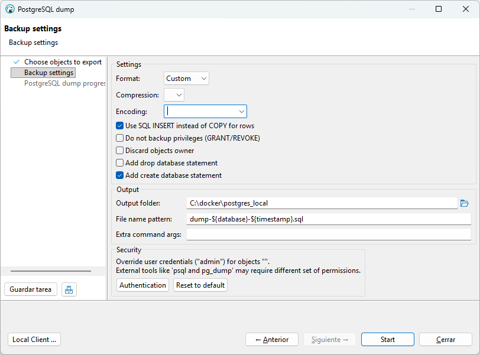
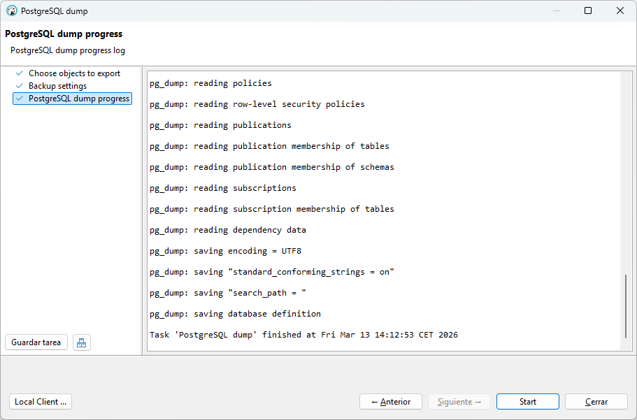

# Seguridad de los datos y copias de seguridad en PostgreSQL

## 1. Introducción

Las bases de datos almacenan información crítica para las organizaciones.  
Por este motivo es imprescindible implementar mecanismos que permitan **proteger los datos y recuperarlos** en caso de fallo del sistema, errores humanos o pérdida accidental de información.

En esta unidad aprenderemos a realizar **copias de seguridad (backups)** y a **restaurar la información** utilizando PostgreSQL.

En el entorno del aula trabajaremos con **PostgreSQL ejecutándose en un contenedor Docker** y utilizaremos la herramienta gráfica **DBeaver** para administrar la base de datos.

---

## 2. Objetivos de la unidad

- Comprender los principios básicos de **seguridad de la información**.
- Conocer los diferentes **tipos de copias de seguridad**.
- Realizar **copias de seguridad en PostgreSQL**.
- Restaurar bases de datos a partir de un **backup**.
- Utilizar **DBeaver** para realizar tareas de administración.

---

## 3. Principios de seguridad de la información

La seguridad de los datos en una base de datos se basa en tres principios fundamentales:

- **Confidencialidad**: Solo los **usuarios autorizados** deben poder acceder a la información. Se refiere al control de accesos y permisos a la BD.
- **Integridad: Los datos** deben mantenerse **correctos y consistentes**. Se refiere a restricciones, claves primarias y foráneas, y reglas de validación.

- **Disponibilidad**: La información debe estar **accesible cuando se necesite**. Se refiere a backups, recuperación ante fallos, y mantenimiento del sistema. Es la parte que veremos en esta unidad.

---

## 4.Copias de seguridad (Backups)

Las copias de seguridad consisten en crear duplicados de la información almacenada en una base de datos con el objetivo de poder recuperarla en caso de pérdida, fallo del sistema, errores humanos o ataques informáticos.
Son un elemento fundamental para garantizar la disponibilidad de los datos.

!!!Tip ""
    Realizar copias de seguridad de forma periódica permite restaurar la información y continuar con el funcionamiento del sistema sin grandes pérdidas de datos.

**Tipos de copias de seguridad**{.azul}

**Según la cantidad de datos que se copian**

- **Copia completa**: Se realiza una copia de toda la base de datos.

- **Copia incremental**: Solo guarda los cambios realizados desde la última copia.

- **Copia diferencial**: Guarda los cambios realizados desde la última copia completa.

  
**Según el momento en que se realizan**

- **Copias en frío**: Se realizan cuando el servidor de base de datos está **detenido**.  Este método garantiza que los datos **no están siendo modificados durante la copia**.
- **Copias en caliente**: Se realizan **mientras la base de datos está funcionando**.  

**Según el tipo de información que se copia**

- **Copias físicas**: Consiste en copiar directamente los archivos internos de la base de datos que PostgreSQL guarda en disco. Este tipo de copia es rápida pero depende del sistema gestor.

- **Copias lógicas**: Consiste en exportar los datos en forma de sentencias SQL o archivos de texto. Estas copias son más portables y permiten restaurar datos en otros servidores.

Además, las copias de seguridad también pueden utilizarse para **replicar o clonar una base de datos en otro servidor**. Para ello se crea el backup en el servidor original, se transfiere el archivo al nuevo servidor y se restaura allí. Este método permite obtener una copia exacta de la base de datos y suele utilizarse para migraciones o para crear entornos de prueba. No obstante, este procedimiento genera una replicación puntual, ya que las bases de datos no se mantienen sincronizadas automáticamente.

## 5. Recuperación de datos

La recuperación de datos es el proceso mediante el cual se restaura una base de datos a un estado correcto después de que haya ocurrido un fallo o pérdida de información. Este proceso permite volver a disponer de los datos y continuar con el funcionamiento normal del sistema.

La recuperación es un elemento clave para garantizar el principio de disponibilidad, ya que permite minimizar la pérdida de información y reducir el tiempo de inactividad del sistema.

Algunas situaciones en las que se necesita recuperación podrían ser:

- Fallos del sistema o del hardware, como averías en el servidor o en el disco duro.
- Errores humanos, como el borrado accidental de datos o tablas.
- Corrupción de datos, cuando la información almacenada se daña.
- Ataques informáticos o accesos no autorizados que afectan a la base de datos.

**Métodos de recuperación**{.azul}

Para recuperar una base de datos normalmente se utilizan copias de seguridad previamente realizadas. Los métodos más comunes son:

- **Restauración completa**: Se recupera toda la base de datos a partir de una copia de seguridad completa.

- **Restauración parcial**: Se recuperan solo determinados datos, tablas o partes de la base de datos.

- **Recuperación a un punto en el tiempo**: Permite restaurar la base de datos a un momento concreto antes de que ocurriera el problema.

**Arquitectura de recuperación en PostgreSQL (WAL)**{.azul}

Algunos sistemas de bases de datos, como Postgres, utilizan mecanismos como Write-Ahead Logging (WAL), donde las operaciones se registran en un log antes de aplicarse a los datos. Esto permite recuperar la base de datos en caso de fallo. Si ocurre un fallo del sistema, PostgreSQL puede leer el WAL y reconstruir los datos.

Dónde está y cómo verlo depende del sistema gestor de bases de datos (SGBD) que estés usando. En PostgreSQL, los archivos WAL se guardan dentro del directorio de datos del servidor. Normalmente están en la carpeta **pg_wal/**.

## 6. Opciones para realizar copias de seguridad en PostgreSQL

En **PostgreSQL** existen diferentes opciones para realizar copias de seguridad, dependiendo de si se quiere copiar una base de datos concreta, todo el servidor o incluso los archivos físicos del sistema. Las herramientas principales que ofrece el sistema permiten realizar **copias lógicas o físicas**.

Una de las herramientas más utilizadas es **pg_dump**, que permite crear copias de seguridad de una base de datos específica. Este tipo de copia se denomina **copia lógica**, ya que exporta la estructura y los datos en forma de sentencias SQL o en formato binario.

Otra opción es **pg_dumpall**, que permite crear una copia de seguridad de todas las bases de datos del servidor PostgreSQL, incluyendo también los roles, usuarios y permisos.

Por otro lado, PostgreSQL también permite realizar **copias físicas** del servidor mediante herramientas como **pg_basebackup**, que copia directamente los archivos del sistema de la base de datos. Este tipo de copia se utiliza principalmente para replicación o recuperación completa del servidor.

En resumen, las principales opciones para realizar copias de seguridad en PostgreSQL son:

| Herramienta     | Qué copia                          | Tipo de copia |
|-----------------|-------------------------------------|---------------|
| `pg_dump`       | Una base de datos                   | Lógica        |
| `pg_dumpall`    | Todas las bases de datos del servidor | Lógica        |
| `pg_basebackup` | Archivos completos del servidor     | Física        |

Estas herramientas permiten adaptar el tipo de copia de seguridad a las necesidades del sistema y al tamaño de la base de datos.

Además de poder realizar copias de seguridad de una base de datos completa o de todo el servidor, PostgreSQL también permite crear copias de **objetos específicos**, como tablas o esquemas. Esto se puede hacer utilizando diferentes opciones del comando **pg_dump**, como -t para copiar una tabla concreta o -n para copiar un esquema completo. Estas opciones permiten realizar copias más selectivas cuando no es necesario respaldar toda la base de datos.

| Herramienta / opción        | Qué copia                                      | Tipo de copia |
|-----------------------------|-----------------------------------------------|---------------|
| `pg_dump -t tabla`          | Una tabla concreta                            | Lógica        |
| `pg_dump -n esquema`        | Un esquema completo                           | Lógica        |

## 6. Copias de seguridad con pg_dump

**pg_dump** es la herramienta principal de PostgreSQL para realizar copias de seguridad lógicas.
En nuestro entorno con **Docker**, **pg_dump** se ejecuta dentro del contenedor de PostgreSQL.

**Formatos de copias de seguridad en PostgreSQL**

En PostgreSQL las copias de seguridad pueden generarse principalmente en dos formatos: **SQL o dump** (formato custom). La elección de uno u otro depende del uso que se quiera dar al backup y de las herramientas que se utilizarán para restaurarlo.

El formato SQL genera un archivo de texto que contiene sentencias SQL como CREATE TABLE, INSERT o ALTER. Estas sentencias permiten reconstruir la base de datos ejecutando el archivo con la herramienta **psql**. Este formato es fácil de leer y editar, por lo que suele utilizarse en entornos de aprendizaje o para bases de datos pequeñas.

Por otro lado, el formato dump o custom es un formato binario generado normalmente con la opción **-Fc** de pg_dump. Este tipo de archivo no es legible directamente, pero permite realizar restauraciones más flexibles utilizando la herramienta **pg_restore**. Entre sus ventajas se encuentran la posibilidad de restaurar solo ciertos objetos de la base de datos o realizar restauraciones en paralelo, lo que resulta especialmente útil en bases de datos de mayor tamaño.

En resumen, el formato SQL es más simple y legible, mientras que el formato dump ofrece mayor flexibilidad y eficiencia durante la restauración.

Para los seguientes ejemplos crearemos una carpeta para los backups

        postgres_local/
        │
        ├─ docker-compose.yml
        └─ backups/

<!--
- Desde la carpeta donde está tu docker-compose.yml:

        docker compose up -d

- Comprobar que el contenedor está funcionando:

        docker compose ps

        Deberías ver algo parecido a:

        NAME       IMAGE           SERVICE    STATUS
        postgres   postgres:16.4   postgres   running        

- Comprobar que PostgreSQL responde:

        docker compose exec postgres psql -U admin -d tienda -c "SELECT version();"

| Parte                          | Función                                  |
| ------------------------------ | ---------------------------------------- |
| docker compose exec postgres | Ejecuta el comando dentro del contenedor |
| psql                         | Cliente de PostgreSQL                    |
| -U admin                     | Usuario                                  |
| -d tienda                    | Base de datos a la que conectarse        |
| -c                           | Ejecuta una consulta                     |
| "SELECT version();"          | Consulta que muestra la versión          |

        Deberías ver algo parecido a:

        version
        ---------------------------------------------------------------------------------------------------------------------
        PostgreSQL 16.4 (Debian 16.4-1.pgdg120+2) on x86_64-pc-linux-gnu, compiled by gcc (Debian 12.2.0-14) 12.2.0, 64-bit
        (1 row)

-->
**Ejemplo práctico 1**: Copia de seguridad de la base de datos **tienda** en formato **SQL**:

- Desde la carpeta donde está tu docker-compose.yml, comprobar que pg_dump está disponible:

        docker compose exec postgres pg_dump --version

Deberías ver algo parecido a:

        pg_dump (PostgreSQL) 16.4 (Debian 16.4-1.pgdg120+2)

- Hacer la copia de seguridad de la bd **tienda** en formato SQL:

        docker compose exec postgres pg_dump -U admin -C tienda > backups/tienda_backup.sql

| Parte                        | Función                                                                |
| -----------------------------| ------------------------------------------------------------------ |
| docker compose exec postgres | Ejecuta un comando dentro del contenedor                           |
| pg_dump                      | Herramienta que crea una copia de seguridad de una base de datos   |
| -U admin                     | Indica el usuario de PostgreSQL con el que se realiza la conexión  |
| -C                           | Incluye en el archivo de backup la instrucción CREATE DATABASE     |
| tienda                       | Nombre de la base de datos que se quiere copiar                    |
| >                            | Redirige la salida del comando a un archivo                        |
| tienda_backup.sql            | Archivo donde se guarda el backup en formato SQL                   |

**Ejemplo práctico 2**: Copia de seguridad de la base de datos **tienda** en formato **dump (binario)**:

Cuando se trabaja con PostgreSQL dentro de un contenedor Docker y se utiliza PowerShell en Windows, pueden aparecer problemas al manejar archivos de backup **binarios** (formato custom) usando redirecciones (>, <) o pipes. Esto ocurre porque PowerShell puede modificar el flujo de datos binarios.

Para evitar estos problemas, la forma más fiable es crear el backup dentro del contenedor y copiarlo después al sistema anfitrión, y hacer lo mismo en el proceso de restauración.

Primero se genera el backup dentro del contenedor usando pg_dump en formato custom:

        docker compose exec postgres pg_dump -U admin -Fc -C tienda -f /tmp/dump-tienda.dump

Después se copia el archivo desde el contenedor a la carpeta backups del sistema anfitrión:

        docker cp postgres:/tmp/dump-tienda.dump backups/dump-tienda.dump

De esta forma el archivo queda guardado en:

        backups/dump-tienda.dump

| Parte                        | Función                                                                 |
|------------------------------|-------------------------------------------------------------------------|
| docker compose exec postgres | Ejecuta un comando dentro del contenedor                               |
| pg_dump                      | Herramienta que crea una copia de seguridad de una base de datos       |
| -U admin                     | Indica el usuario de PostgreSQL con el que se realiza la conexión      |
| -Fc                          | Genera el backup en formato custom (binario) compatible con pg_restore |
| -C                           | Incluye en el backup la instrucción CREATE DATABASE                    |
| tienda                       | Nombre de la base de datos que se quiere copiar                        |
| -f                           | Permite indicar el archivo donde se guardará el backup                 |
| /tmp/dump-tienda.dump        | Ruta dentro del contenedor donde se guarda el archivo de backup        |

## 7. Restaurar una copia de seguridad en PostgreSQL

En PostgreSQL existen diferentes herramientas que permiten realizar estas restauraciones, dependiendo principalmente del formato en el que se haya creado la copia de seguridad. Cuando el backup se encuentra en **formato SQL**, la restauración se realiza ejecutando las sentencias contenidas en el archivo mediante la herramienta **psql**. Por otro lado, cuando la copia de seguridad se ha generado en un **formato binario o personalizado**, se utiliza la herramienta **pg_restore**, que permite restaurar la información de forma más flexible.

Al restaurar una copia de seguridad en PostgreSQL, en algunos casos, el archivo de backup incluye la sentencia **CREATE DATABASE**, que crea automáticamente la base de datos durante la restauración. Por el contrario, si el archivo de backup no contiene la sentencia de creación de la base de datos, entonces es necesario crear la base de datos manualmente antes de restaurar el backup. Una vez creada, se ejecuta la restauración indicando esa base de datos como destino para que se creen las tablas, datos y demás objetos.   

Para crear una base de datos a partir de otra existente desde Docker Compose, debes ejecutar el comando SQL usando psql dentro del contenedor: 

        docker compose exec postgres psql -U admin -d postgres -c "CREATE DATABASE nueva_bd;"

**Ejemplo práctico 3 - Restauración con psql**: En este ejemplo vamos a restaurar la copia de seguridad de la BD tienda, que hicimos en el ejemplo práctico 1. Como la copia la hicmos en formato SQL, la restauración la haremos con **psql**.

        docker compose exec -T postgres psql -U admin -d tienda < tienda_backup.sql

!!!Note "Nota"
    Si aparece el error: `En línea: 1 Carácter: 63`. Este error  es debido a que estás usando PowerShell, y en PowerShell el operador **<** no funciona para redirección como en Linux o bash.

    Una posible solución sería utilizar **type** o **Get-Content**:

        type backups/tienda_backup.sql | docker compose exec -T postgres psql -U admin -d tienda   

**Ejemplo práctico 4 - Restauración con pg_restore**: En este ejemplo vamos a restaurar la copia de seguridad de la BD tienda, que hicimos en el ejemplo práctico 2. Como la copia la hicmos en formato dump, la restauración la haremos con **pg_restore**.  
Para que **pg_restore** funcione, el backup no puede ser un **.sql**, debe crearse con **pg_dump en formato binario (custom)** usando la opción **-Fc**.

Para restaurar la copia de seguridad, primero se vuelve a copiar el archivo al contenedor:

        docker cp backups/dump-tienda.dump postgres:/tmp/dump-tienda.dump

Después se ejecuta pg_restore dentro del contenedor:

        docker compose exec postgres pg_restore -U admin -C -d postgres /tmp/dump-tienda.dump

La opción -C permite que el proceso cree la base de datos tienda automáticamente antes de restaurar su contenido.

## 8. Copias de seguridad con DBeaver

DBeaver permite realizar copias de seguridad utilizando una interfaz gráfica.

Pasos:

1. Conectarse al servidor PostgreSQL.
2. Hacer clic derecho sobre la base de datos.
3. Seleccionar Tools → Backup.
4. Elegir el formato de exportación.
5. Guardar el archivo de backup.
9. Restauración con DBeaver

Para restaurar una copia de seguridad en DBeaver:

1. Crear una base de datos nueva.
2. Hacer clic derecho sobre la base de datos.
3. Seleccionar Tools → Restore.
4. Elegir el archivo de backup.
5. Ejecutar la restauración.

Para saber las bd que tiene el servidor:

        docker compose exec postgres psql -U admin -d postgres -l